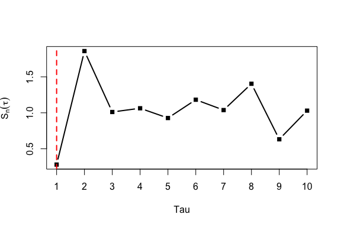

# VMAorder

## Overview

`VMAorder` provides tools for simulation, statistic construction, order
estimation, stationarity checking, and visualization for vector
moving-average (VMA) models.

The package focuses on multivariate time series of the form

``` math
x_t = z_t + \sum_{h=1}^{q} A_h z_{t-h},
```

where $`z_t`$ is a white-noise innovation vector and (A_h) is the
coefficient matrix at lag $`h`$. It is mainly designed for exploratory
and methodological experiments with high-dimensional VMA-type processes.

A typical workflow is:

1.  generate VMA coefficient matrices;
2.  simulate multivariate VMA observations;
3.  compute lagged cross-covariance matrices;
4.  construct VMA order statistics;
5.  estimate the VMA order;
6.  check stationarity and visualize statistic curves.

## Installation

You can install the development version of `VMAorder` from GitHub with:

``` r

# install.packages("pak")
pak::pak("qin01546-ops/VMAorder")
```

After installation, load the package with:

``` r

library(VMAorder)
```

## Main Functions

| Function | Purpose |
|----|----|
| [`simVMAcoef()`](https://qin01546-ops.github.io/VMAorder/reference/simVMAcoef.md) | Generate sparse coefficient matrices for a VMA model. |
| [`simVMA()`](https://qin01546-ops.github.io/VMAorder/reference/simVMA.md) | Simulate observations from a VMA model. |
| [`covVMA()`](https://qin01546-ops.github.io/VMAorder/reference/covVMA.md) | Estimate lagged cross-covariance matrices. |
| [`statVMA()`](https://qin01546-ops.github.io/VMAorder/reference/statVMA.md) | Compute VMA order statistics over candidate lags. |
| [`orderVMA()`](https://qin01546-ops.github.io/VMAorder/reference/orderVMA.md) | Estimate the VMA order using a stable-interval rule. |
| [`stationVMA()`](https://qin01546-ops.github.io/VMAorder/reference/stationVMA.md) | Test stationarity for each variable in a multivariate series. |
| [`plotVMA()`](https://qin01546-ops.github.io/VMAorder/reference/plotVMA.md) | Visualize mean statistic curves from repeated simulations. |

## Quick Example

The following example simulates a VMA(2) process with 5 variables and
100 observations.

``` r

fit <- simVMA(n = 100, p = 5, order = 2, seed = 123)

dim(fit$x)
#> [1] 100   5
head(fit$x)
#>              X1         X2         X3           X4         X5
#> [1,] -0.1089660  0.4520302 -0.4628790  1.102593437 -1.4413167
#> [2,] -0.1172420  0.5268557 -1.9111513 -0.784310368 -1.6156411
#> [3,]  0.1830826 -0.2302622  0.3698160 -0.596863723  0.6076538
#> [4,]  1.2805549  1.3974267 -0.4622881  0.005525749  0.7484698
#> [5,] -1.7272706  1.7636530  0.3219559 -0.311691381  0.5811898
#> [6,]  1.6901844  0.4856014 -0.2840014  0.764676679  0.1845464
```

The simulated data are stored in `fit$x`, and the coefficient matrices
are stored in `fit$coef` or `fit$coeff`.

``` r

dim(fit$coeff)
#> [1] 5 5 2
fit$coeff[, , 1]
#>    X1 X2          X3 X4 X5
#> X1  0  0 0.000000000  0  0
#> X2  0  0 0.000000000  0  0
#> X3  0  0 0.000000000  0  0
#> X4  0  0 0.000000000  0  0
#> X5  0  0 0.008976922  0  0
```

## Lagged Cross-Covariance Matrix

The function
[`covVMA()`](https://qin01546-ops.github.io/VMAorder/reference/covVMA.md)
estimates the lagged cross-covariance matrix at a given lag.

``` r

gamma1 <- covVMA(fit$x, lag = 1)

dim(gamma1)
#> [1] 5 5
round(gamma1[1:3, 1:3], 4)
#>         X1      X2      X3
#> X1 -0.0285  0.1179 -0.1456
#> X2 -0.0887 -0.1255  0.1474
#> X3  0.0440  0.0899 -0.0804
```

## VMA Statistic

The function
[`statVMA()`](https://qin01546-ops.github.io/VMAorder/reference/statVMA.md)
computes the statistic values over a set of candidate lags.

``` r

stat_result <- statVMA(fit$x, lag = 1:5)

stat_result
#>   lag        Sn
#> 1   1 0.2802450
#> 2   2 1.8580184
#> 3   3 1.0111102
#> 4   4 1.0631176
#> 5   5 0.9273607
```

These statistics are used by
[`orderVMA()`](https://qin01546-ops.github.io/VMAorder/reference/orderVMA.md)
to estimate the model order.

## Order Estimation

The function
[`orderVMA()`](https://qin01546-ops.github.io/VMAorder/reference/orderVMA.md)
estimates the VMA order using a stable-interval rule. The selected order
is taken as one lag before the statistic enters a stable interval.

``` r

order_result <- orderVMA(fit$x, lag = 1:10, draw = FALSE)

order_result$order
#> [1] 1
order_result$table
#>    lag        Sn inside_interval   lower  upper  width tail_mean tail_sd
#> 1    1 0.2802450            TRUE -0.1581 2.1581 1.1581    1.0219   0.386
#> 2    2 1.8580184            TRUE -0.1581 2.1581 1.1581    1.0219   0.386
#> 3    3 1.0111102            TRUE -0.1581 2.1581 1.1581    1.0219   0.386
#> 4    4 1.0631176            TRUE -0.1581 2.1581 1.1581    1.0219   0.386
#> 5    5 0.9273607            TRUE -0.1581 2.1581 1.1581    1.0219   0.386
#> 6    6 1.1817878            TRUE -0.1581 2.1581 1.1581    1.0219   0.386
#> 7    7 1.0379800            TRUE -0.1581 2.1581 1.1581    1.0219   0.386
#> 8    8 1.4038172            TRUE -0.1581 2.1581 1.1581    1.0219   0.386
#> 9    9 0.6319112            TRUE -0.1581 2.1581 1.1581    1.0219   0.386
#> 10  10 1.0300187            TRUE -0.1581 2.1581 1.1581    1.0219   0.386
#>    stable_start q_hat_interval
#> 1             2              1
#> 2             2              1
#> 3             2              1
#> 4             2              1
#> 5             2              1
#> 6             2              1
#> 7             2              1
#> 8             2              1
#> 9             2              1
#> 10            2              1
```

If `draw = TRUE`, the statistic curve is plotted and the estimated order
is marked by a vertical dashed line.

``` r

orderVMA(fit$x, lag = 1:10, draw = TRUE)
```



``` R
#> $order
#> [1] 1
#> 
#> $interval
#> $interval$q_hat
#> [1] 1
#> 
#> $interval$stable_start
#> [1] 2
#> 
#> $interval$lower
#> [1] -0.1580503
#> 
#> $interval$upper
#> [1] 2.15805
#> 
#> $interval$tail_mean
#> [1] 1.021916
#> 
#> $interval$tail_sd
#> [1] 0.3860168
#> 
#> $interval$width
#> [1] 1.15805
#> 
#> $interval$inside
#>  [1] TRUE TRUE TRUE TRUE TRUE TRUE TRUE TRUE TRUE TRUE
#> 
#> 
#> $table
#>    lag        Sn inside_interval   lower  upper  width tail_mean tail_sd
#> 1    1 0.2802450            TRUE -0.1581 2.1581 1.1581    1.0219   0.386
#> 2    2 1.8580184            TRUE -0.1581 2.1581 1.1581    1.0219   0.386
#> 3    3 1.0111102            TRUE -0.1581 2.1581 1.1581    1.0219   0.386
#> 4    4 1.0631176            TRUE -0.1581 2.1581 1.1581    1.0219   0.386
#> 5    5 0.9273607            TRUE -0.1581 2.1581 1.1581    1.0219   0.386
#> 6    6 1.1817878            TRUE -0.1581 2.1581 1.1581    1.0219   0.386
#> 7    7 1.0379800            TRUE -0.1581 2.1581 1.1581    1.0219   0.386
#> 8    8 1.4038172            TRUE -0.1581 2.1581 1.1581    1.0219   0.386
#> 9    9 0.6319112            TRUE -0.1581 2.1581 1.1581    1.0219   0.386
#> 10  10 1.0300187            TRUE -0.1581 2.1581 1.1581    1.0219   0.386
#>    stable_start q_hat_interval
#> 1             2              1
#> 2             2              1
#> 3             2              1
#> 4             2              1
#> 5             2              1
#> 6             2              1
#> 7             2              1
#> 8             2              1
#> 9             2              1
#> 10            2              1
```

## Stationarity Test

The function
[`stationVMA()`](https://qin01546-ops.github.io/VMAorder/reference/stationVMA.md)
applies the Augmented Dickey-Fuller test to each variable in the
multivariate time series.

``` r

station_result <- stationVMA(fit$x)
#> Registered S3 method overwritten by 'quantmod':
#>   method            from
#>   as.zoo.data.frame zoo
#> Warning in tseries::adf.test(x[, j]): p-value smaller than printed p-value
#> Warning in tseries::adf.test(x[, j]): p-value smaller than printed p-value
#> Warning in tseries::adf.test(x[, j]): p-value smaller than printed p-value
#> sample size: 100 
#> dimension: 5 
#> non-stationary: 0

station_result$non_stationary
#> [1] 0
station_result$table
#>   variable    p_value     result
#> 1       X1 0.01208235 stationary
#> 2       X2 0.01000000 stationary
#> 3       X3 0.01000000 stationary
#> 4       X4 0.01000000 stationary
#> 5       X5 0.03447247 stationary
```

## Visualization

The function
[`plotVMA()`](https://qin01546-ops.github.io/VMAorder/reference/plotVMA.md)
can be used to compare mean statistic curves across different VMA orders
and simulation settings.

``` r

settings <- data.frame(
  p = c(5, 8),
  n = c(80, 100)
)

out <- plotVMA(
  order = c(2, 3),
  settings = settings,
  R = 5,
  lag = 1:6
)

out$plot
```

This example is not evaluated in the README because repeated simulations
may take longer to run.

## Development

Run unit tests with:

``` r

devtools::test()
```

Run a full package check with:

``` r

devtools::check()
```

Update documentation with:

``` r

devtools::document()
```

Rebuild the README after editing `README.Rmd` with:

``` r

devtools::build_readme()
```

## Notes

- Rows of the input data matrix are treated as time points.
- Columns of the input data matrix are treated as variables.
- The package is intended for simulation studies and methodological
  experiments with VMA-type models.
- Some functions rely on suggested packages such as `tseries` and
  `ggplot2`.
